# 🤖 RecruitAI: Agentic JD & Aptitude Suite

### _Transforming Job Descriptions into Technical Assessments in Seconds_

RecruitAI is an end-to-end Hiring ecosystem that combines **AI-Powered JD Generation** with **Role-Specific Aptitude Testing**. Built using **Llama 3.3 (70B)** via Groq, it ensures that every candidate is evaluated against the exact requirements of your role.

---

## 🚀 Interconnected Job-to-Test Workflow

RecruitAI features a unique bidirectional integration where the output of the JD Generator serves as the primary intelligence for the Aptitude Generator.

```mermaid
graph TD
    %% JD Generation Phase
    subgraph JD_Generator_Module
        U[👤 Recruiter] -->|Input: Role & Skills| JD_A[🤖 JD AI Agent]
        JD_A -->|Process| JD_O[📄 Professional JD]
    end

    %% The Interconnection
    JD_O -->|Interconnect: Direct Feed| APT_I[⚡ Aptitude Analysis]

    %% Aptitude Phase
    subgraph Aptitude_Suite_Module
        APT_I -->|Extract Technical Core| APT_A[🧠 MCQ Generator Agent]
        APT_A -->|Output| Q_LIST[📋 Selected MCQs]
        Q_LIST -->|One-Click Outreach| EMAIL[📧 Candidate Inbox]
    end

    %% Candidate Experience
    subgraph Candidate_Experience
        EMAIL -->|Assessment Link| TEST[💻 Distraction-Free Quiz]
        TEST -->|Auto-Score| DB[(📊 Tracking Dashboard)]
    end
```



### 🔗 The "Strategic Feed" Workflow

1.  **JD Phase**: The Recruiter provides a job title (e.g., "Fullstack Developer") and key tech stack. The **JD AI Agent** generates a comprehensive job description.
2.  **The Interconnection**: This generated JD is fed directly into the **Aptitude Analysis** engine. Instead of a generic test, the system maps questions specifically to the nuances of the generated JD.
3.  **Aptitude Phase**: The **MCQ Generator** hand-picks 10-25 technical questions. The recruiter selects the best ones and triggers the email outreach.
4.  **Closing the Loop**: Candidates take the test, and their results are automatically recorded in the unified dashboard for the HR team.

---

## ✨ Features

### 📝 JD Generator

- **Context-Aware**: Generates role-specific content, not generic templates.
- **Premium Formatting**: Beautifully structured output ready for LinkedIn or Job Boards.
- **Export Options**: Download as PDF or Copy to Clipboard.

### 🎯 Aptitude Generator

- **JD Analysis**: Maps questions directly to the skills mentioned in your JD.
- **Custom Selection**: Hand-pick the questions generated by the AI before sending.
- **Unique Tracking**: Every candidate URL is unique and tied to their email.

### 💻 Candidate Test Interface

- **Multi-Step Navigation**: Focus on one question at a time with "Next" and "Back" support.
- **Progress Tracking**: Real-time counter of current question vs total.
- **Glassmorphic Design**: A premium, modern UI that reflects your brand's quality.

### 📈 Analytics Dashboard

- **Role-Based View**: See stats for "Lead Developer", "React Intern", etc.
- **Candidate Breakdown**: Detailed table showing Candidate Email, Status, and Score.

---

## 🛠️ Technology Stack

- **LLM Core**: Llama 3.3 (70B) via **Groq Cloud** for lightning-fast inference.
- **Backend**: **FastAPI** (Python) with BackgroundTasks for SMTP stability.
- **Frontend**: Vanilla **Javascript & CSS** (Glassmorphism theme).
- **Email Engine**: Gmail SMTP Integration.

---

## 🚀 Quick Start (LinkedIn Post Draft)

**Headline**: I just built an Agentic Hiring Suite that turns a Job Title into a Live Technical Test in < 60 seconds! 🚀

**Body**:
Ever spent hours writing a JD and then looking for relevant interview questions? I decided to automate the whole thing.

My new project **RecruitAI** uses #Llama3.3 to:

1. Generate a professional JD 📝
2. Map that JD to technical MCQs 🧠
3. Send those MCQs to candidates via email 📧
4. Track scores in a live dashboard 📈

It’s built using **FastAPI** and **Groq** for extra speed. No more "resume fatigue"—just data-driven hiring.

Check out the workflow below! 👇
#AI #Recruiting #Python #MachineLearning #WebDevelopment #Automation

---

## 📜 Installation

1.  Navigate to `Aptitude_Generator/backend`.
2.  Create a `.env` file:
    ```ini
    GROQ_API_KEY=your_key
    SMTP_USER=your_email
    SMTP_PASSWORD=your_app_password
    ```
3.  Install dependencies: `pip install -r requirements.txt`
4.  Run: `python -m uvicorn main:app --port 8002 --reload`
5.  Open `Aptitude_Generator/frontend/index.html`.

---

**Built with ❤️ for Modern Recruiter**
