# 🤖 Agentic AI Hiring Suite (v4.0)
### *End-to-End Recruitment Automation Powered by OpenAI GPT-4o*

[]()
[]()
[]()
[]()

---

## 🚀 Overview
The **Agentic AI Hiring Suite** is a complete ecosystem for technical recruitment. It moves beyond simple resume parsing to automate the entire funnel: from writing the Job Description (JD) to creating custom assessments, screening candidates, and even automating the final outreach.

---

## 🧠 The "Master" Workflow

This diagram covers every single step in the pipeline, from the moment a recruiter thinks of a role to the final hiring dossier.

```mermaid
graph TD
    %% ---------------------------------------------------------
    %% PHASE 1: INTELLIGENT PREPARATION (JD & PRE-WORK)
    %% ---------------------------------------------------------
    subgraph "Phase 1: Agentic Preparation"
        Recruiter([👤 Recruiter]) -->|1. Inputs Role Basics| JD_UI["💻 JD Generator UI"]
        
        JD_UI -->|Trigger| JD_Agent["🤖 JD Agent (GPT-4o)"]
        JD_Agent -->|Step A: Market Research| Market_Data["📊 Tech Stack Inference"]
        JD_Agent -->|Step B: ATS Optimization| Keyword_Inject["🔑 Inject Hidden Keywords"]
        
        Market_Data & Keyword_Inject -->|Generate| JD_Final["📄 Structured JD Output"]
        
        JD_Final -->|2. Auto-Create Test| Apt_UI["⚙️ Assessment Agent"]
        Apt_UI -->|Analyze JD Skills| Q_Gen["🧠 Question Generator"]
        Q_Gen -->|Create 25 MCQs + 4 Code| Test_JSON["📝 Assessment JSON"]
    end

    %% ---------------------------------------------------------
    %% PHASE 2: RESUME INGESTION & FILTERING
    %% ---------------------------------------------------------
    subgraph "Phase 2: Ingestion & Filtering"
        Recruiter -->|3. Upload Resumes| Manual["📂 Manual Upload"]
        Gmail["📧 Gmail Inbox"] -->|4. Auto-Fetch| G_Service["📨 Gmail Service"]
        
        G_Service -->|Recursive Scan| EML_Parse["📦 Extract .eml Attachments"]
        Manual & EML_Parse -->|Raw PDFs| OCR["👀 PDF Parser / OCR"]
        
        OCR -->|Clean Text| Sanitizer["🧹 Text Cleaner & PII Masker"]
        
        Sanitizer -->|Check Metadata| Page_Rule{"⚠️ Page Count Rule"}
        Page_Rule -->|Junior > 1 Pg| Reject_1["🔴 REJECT: Non-Compliant"]
        
        Page_Rule -->|Pass| Role_Guard{"🛡️ BART Zero-Shot"}
        Role_Guard -->|Score < 0.45| Skip_1["❌ SKIP: Wrong Role"]
    end

    %% ---------------------------------------------------------
    %% PHASE 3: HYBRID SCORING & ANALYSIS
    %% ---------------------------------------------------------
    subgraph "Phase 3: Deep Screening"
        Role_Guard -->|Pass| Vectorizers["🧬 Vector Embeddings"]
        
        %% SCORING ENGINE
        Vectorizers -->|Cosine Sim| Score_Sem["📐 Semantic Score (15%)"]
        Sanitizer -->|Extract Skills| Score_Key["🔑 Keyword Match (25%)"]
        Sanitizer -->|Calc Experience| Score_Exp["⏳ Experience Score (20%)"]
        Sanitizer -->|Check Degree| Score_Edu["🎓 Education Score (10%)"]
        Sanitizer -->|Analyze Layout| Score_Vis["🎨 Visual Score (30%)"]
        
        Score_Sem & Score_Key & Score_Exp & Score_Edu & Score_Vis -->|Sum| Total_Score["🧮 Hybrid Fit Score"]
        
        Total_Score -->|Sort Descending| Ranking["📊 Candidate Ranking"]
        
        Ranking -->|Top N + 5| AI_Deep["🧠 GPT-4o Deep Read"]
        AI_Deep -->|Analyze Gaps & Red Flags| Reasoning["💡 AI Critique"]
        
        Reasoning -->|Final Cutoff| Selection{"🏆 Is Selected?"}
    end

    %% ---------------------------------------------------------
    %% PHASE 4: AUTOMATED ACTION & EVALUATION
    %% ---------------------------------------------------------
    subgraph "Phase 4: Optimization & Outreach"
        Selection -->|No| Soft_Rej["🟡 Not Selected List"]
        Soft_Rej -->|Trigger| Email_Rej["📧 Send Rejection Email"]
        
        Selection -->|Yes| Shortlist["🟢 Shortlisted"]
        Shortlist -->|Trigger| Email_Invite["📧 Send Test Invite"]
        
        Email_Invite -->|Link Click| Candidate["👤 Candidate Portal"]
        Test_JSON -.-> Candidate
        
        Candidate -->|Submit Test| Auto_Grader["🤖 AI Auto-Grader"]
        Auto_Grader -->|Eval Code Complexity| Code_Score["💻 Code Score"]
        Auto_Grader -->|Check Answer Key| MCQ_Score["📝 MCQ Score"]
        
        Code_Score & MCQ_Score & Reasoning -->|Compile| Final_Report["🎖️ FINAL HIRING DOSSIER"]
    end
```



---

## ✨ Features by Module

### 1. **JD Generator**
*   **ATS-Optimized:** Generates JDs with hidden keyword layers to ensure compatibility with other ATS systems.
*   **Smart Inferencing:** Infers tech stacks and soft skills based on simple role titles (e.g., "Backend Dev" -> Python, FastAPI, Docker, SQL).

### 2. **Aptitude Generator**
*   **Dynamic Assessments:** Creates a 100% unique test for every JD.
*   **Code Challenges:** Generates language-agnostic DSA problems with test cases.
*   **Structure:** 25 MCQs + 4 Coding Questions per test.

### 3. **Resume Screener (The Core)**
*   **Deep Gmail Integration:** Recursively extracts resumes from forwarded emails (`.eml` support) and filters by date.
*   **Zero-Shot Filtering:** Uses `facebook/bart-large-mnli` to reject candidates applying for the wrong role.
*   **GPT-4o Reasoning:** Provides detailed feedback: *Why* is this candidate a good fit? What are their hidden red flags?

### 4. **Automated Outreach**
*   **Rejection Emails:** Sends polite, personalized rejection emails to candidates who didn't make the cut, maintaining employer brand.
*   **Assessment Invites:** Automatically emails shortlisted candidates with a link to the generated aptitude test.

---

## 🛠️ Installation & Setup

### Prerequisites
*   Python 3.10+
*   **OpenAI API Key** (Required for all AI features)
*   **Google Cloud Credentials** (For Gmail Integration)

### 1. Clone & Install
```bash
git clone https://github.com/Prabhat9801/Agentic_ATS_Scorer.git
cd Agentic_ATS_Scorer
pip install -r requirements.txt
```

### 2. Configuration (.env)
Create a `.env` file in the root directory:
```ini
OPENAI_API_KEY=sk-proj-...
# Optional: HuggingFace Token for Vision capabilities
HUGGINGFACE_API_TOKEN=hf_...
```

### 3. Gmail Auth Setup
1.  Place your `credentials.json` (from Google Cloud Console) in the root.
2.  The system will auto-generate `token.json` on the first run.

### 4. Run the Unified Server
Start the master server which launches all 3 modules:
```bash
python -m uvicorn Backend.app.main:app --reload
```
*   **Resume Dashboard:** `http://127.0.0.1:8000`
*   **JD Generator:** `http://127.0.0.1:8000/jd-tools/`
*   **Aptitude Generator:** `http://127.0.0.1:8000/aptitude/`

---

## 🖥️ User Guide

1.  **Generate a JD:** Go to `/jd-tools/`, enter role details, and generate. Copy the output.
2.  **Create Assessment:** Go to `/aptitude/`, paste the JD, and generate a test JSON.
3.  **Screen Resumes:**
    *   Go to the **Main Dashboard**.
    *   Paste the JD.
    *   Check **"Include Gmail Resumes"** to fetch from inbox.
    *   Click **Analyze**.
    *   View ranked results with AI-written critiques.
4.  **Finalize:** System sends emails and assessment links automatically.

---

## 📜 License
MIT License. Open source for enterprise innovation.
