# 🧬 Resurrection Screening Agent (v3.2)
### *The Enterprise-Grade AI Hiring Assistant*

[]()
[-blue?style=flat-square&logo=meta&logoColor=white)]()
[]()
[]()
[]()

---

## 🚀 Overview
The **Resurrection Screening Agent** is a next-generation Resume ATS (Applicant Tracking System) that eliminates the manual "resume fatigue" problem. Unlike traditional keyword matchers, this system uses a **Hybrid Brain** approach:
1.  **Semantic Intelligence:** Understands that "C++" and "Systems Programming" are related.
2.  **Deep Source Integration:** Automatically fetches resumes from Gmail, even if they are buried inside forwarded emails (`.eml` attachments).
3.  **Hiring Manager Persona:** Uses **Llama 3.3** to write detailed, human-like critiques for shortlisted candidates.

---

## 🧠 System Architecture & Workflow

```mermaid
graph TD
    %% User Interaction
    User([👤 Recruiter]) -->|1. Upload JD| UI[💻 Frontend Dashboard]
    User -->|2a. Drag & Drop| UPLOAD[📂 Manual Files]
    GM[📧 Gmail Account] -->|2b. Auto-Fetch| API_G[📨 Gmail API Service]
    
    UI -->|3. Trigger Analysis| API[⚡ FastAPI Backend]
    UPLOAD & API_G -->|Stream Content| API

    %% Data Processing Pipeline
    subgraph Ingestion Layer
        API_G -->|Recursive Extract| PARSE[📄 Unified Parser]
        UPLOAD --> PARSE
        PARSE -->|Clean| NLP[🧹 Text Sanitizer]
        NLP -->|Anonymize| PII[🛡️ PII Masking]
    end

    %% Intelligence Layer
    subgraph Logic Core
        PII -->|Vectorize| VEC[🧬 ChromaDB Embeddings]
        VEC -->|Compare| SEM[📐 Semantic Similarity]
        
        NLP -->|Extract Keywords| KEY[🔑 Keyword Matcher]
        
        SEM & KEY -->|Compute| SCORE[🧮 Hybrid Score Engine]
    end

    %% Decision Layer
    subgraph Decision Funnel
        SCORE -->|Check Constraints| RULES{⚠️ Hard Rules?}
        RULES -->|Yes: >2 Pages / Corrupt| REJ_HARD[🔴 Hard Rejected]
        
        RULES -->|No| RANK[📊 Rank Candidates]
        RANK -->|Top N Selection| CUTOFF{🏆 Is Top N?}
        
        CUTOFF -->|No| REJ_SOFT[🟡 Not Selected]
        REJ_SOFT -->|Brief Reason| LLM_LITE[🤖 Llama 3.3 Lite]
        
        CUTOFF -->|Yes| SHORT[🟢 Shortlisted]
        SHORT -->|Detailed Analysis| LLM_FULL[🧠 Llama 3.3 Pro]
    end

    %% Output Layer
    LLM_LITE & LLM_FULL & REJ_HARD -->|JSON Response| REPORT[📋 Structural Report]
    REPORT -->|Render| DASH[📈 Interactive Results UI]
```



---

## ✨ Key Features

### 1. **Deep Gmail Integration**
*   **Recursive Parsing:** Smart enough to extract resumes from emails that are *attached* to other emails (handling nested `.eml` files from forwarding or job portals).
*   **Inclusive Date Logic:** Precise date filtering (Start 00:00 to End 23:59:59) ensures you never miss a candidate.

### 2. **Hybrid Scoring Engine**
Candidates are evaluated on a weighted multi-dimensional scale:
*   **Keywords (25%):** Hard skills match (e.g., Python, Docker).
*   **Experience (20%):** Years of relevant experience vs JD requirements.
*   **Education (10%):** Tier-1 degree verification.
*   **Visuals (30%):** Formatting, whitespace, and presentation quality.
*   **Semantic (15%):** Embedding similarity (Cos Sim) for "meaning" match.

### 3. **Hiring Manager Persona**
*   **Structured Feedback:** Provides specific reasoning for every decision.
*   **Holistic Analysis:** Extracts and evaluates **Activities, Hobbies, & Achievements** to find well-rounded candidates.
*   **Three-Tier Filtering:** Implements a strict funnel (Hard Reject -> Soft Reject -> Shortlist).

---

## 🛠️ Installation & Setup

### Prerequisites
*   Python 3.10+
*   Groq API Key (for LLM)
*   Google Cloud Credentials (for Gmail)

### 1. Clone the Repository
```bash
git clone https://github.com/Prabhat9801/Agentic_ATS_Scorer.git
cd Agentic_ATS_Scorer
```

### 2. Set up Environment
Create a `.env` file in the root directory:
```ini
GROQ_API_KEY=your_groq_api_key_here
```

### 2.1 Setup Gmail Credentials
1.  Go to Google Cloud Console > Enable **Gmail API**.
2.  Create OAuth 2.0 Credentials (Desktop App).
3.  Download the JSON file, rename it to `credentials.json`, and place it in the **root directory**.

### 3. Install Dependencies
```bash
pip install -r requirements.txt
```

### 4. Run the System
Start the Backend Server (FastAPI):
```bash
python -m uvicorn Backend.app.main:app --reload
```
*The server will start at `http://127.0.0.1:8000`*

### 5. Launch UI
Simply open `Frontend/index.html` in your browser. No build step required!

---

## 🖥️ Usage Guide

1.  **Input JD:** Paste the Job Description text OR drop a PDF file.
2.  **Add Candidates:**
    *   **Option A:** Drag & drop files manually.
    *   **Option B (New):** Check "Include Gmail Resumes" and select a Date Range.
    *   *Note: Date range is inclusive (Start 00:00 to End 23:59:59).*
3.  **Set Cutoff:** Choose how many candidates you want to shortlist (e.g., Top 5).
4.  **Analyze:** Click "Run Analysis".
    *   *System searches inbox -> Extracts PDFs -> Parses -> Scores -> Reports.*
5.  **Review:**
    *   **Recommendation Tab:** See AI feedback.
    *   **Reports Folder:** Check `Reports/` on disk for organized folders:
        *   `Shortlisted_Resumes`
        *   `Not_Selected_Resumes`
        *   `Rejected_Resumes`

---

## 📜 License
MIT License. Open source for educational and enterprise use.

---

### *Refined. Resurrected. Ready to Hire.*
**Built with ❤️ for High-Volume Recruitment**
